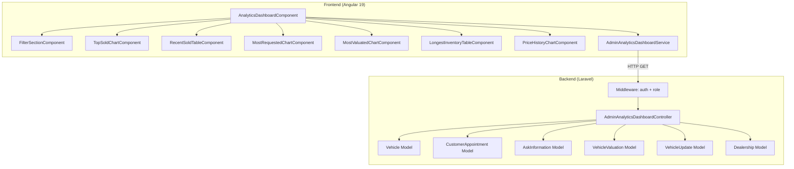

# Documento de Diseño: Dashboard de Analytics para Admin

## Visión General

Este documento describe el diseño técnico para implementar un dashboard de analytics avanzado en el panel de administración de ABCars. El dashboard extiende la funcionalidad existente del módulo de analytics (que actualmente muestra page views y form submissions) con reportes específicos del negocio automotriz: vehículos más vendidos, ventas recientes, vehículos más solicitados, más valuados, antigüedad en inventario y oscilaciones de precios.

La solución se compone de:
- **Backend (Laravel)**: Nuevos endpoints en un controlador `AdminAnalyticsDashboardController` dentro del namespace `Analytics`, protegidos con middleware `auth:sanctum` y `role:administrator|super_admin`.
- **Frontend (Angular 19)**: Un nuevo componente standalone `AnalyticsDashboardComponent` con sub-componentes para cada sección de reporte, usando Angular Material + Tailwind CSS y `ng2-charts` (Chart.js) para las gráficas.

### Decisiones de Diseño Clave

1. **Controlador separado**: Se crea `AdminAnalyticsDashboardController` en lugar de extender el `AnalyticsController` existente, ya que este último maneja page views y form submissions (analytics web), mientras que el nuevo dashboard se enfoca en métricas de negocio (inventario, ventas, valuaciones).
2. **ng2-charts (Chart.js)**: Se elige sobre ngx-charts por ser más ligero, tener mejor compatibilidad con Angular 19, y ofrecer mayor flexibilidad para personalización con Tailwind CSS.
3. **Componente standalone**: El nuevo dashboard será un componente standalone con lazy loading para no impactar el bundle del módulo administrador existente.
4. **Filtros como query params**: Los filtros de periodo y sucursal se envían como query parameters a cada endpoint, permitiendo que cada sección se cargue independientemente.

## Arquitectura



### Flujo de Datos

1. El usuario accede a `/admin/administrator/analytics-dashboard`
2. `AnalyticsDashboardComponent` carga los filtros (periodo por defecto: 30 días, sucursal: todas)
3. Cada sub-componente de reporte solicita sus datos al `AdminAnalyticsDashboardService`
4. El servicio hace peticiones HTTP GET a los endpoints del backend con los parámetros de filtro
5. El controlador ejecuta queries agregadas sobre los modelos existentes y retorna JSON
6. Los sub-componentes renderizan las gráficas/tablas con los datos recibidos

## Componentes e Interfaces

### Backend

#### AdminAnalyticsDashboardController

Ubicación: `abcars-backend/app/Http/Controllers/Analytics/AdminAnalyticsDashboardController.php`

```php
class AdminAnalyticsDashboardController extends Controller
{
    // Parámetros comunes validados en cada método:
    // - start_date: date, opcional (default: hoy - 30 días)
    // - end_date: date, opcional (default: hoy)
    // - dealership_id: integer, opcional (default: null = todas)

    public function topSold(Request $request): JsonResponse
    public function recentSold(Request $request): JsonResponse
    public function mostRequested(Request $request): JsonResponse
    public function mostValuated(Request $request): JsonResponse
    public function longestInventory(Request $request): JsonResponse
    public function priceHistory(Request $request): JsonResponse
    public function dealerships(): JsonResponse
}
```

#### Rutas API

```
GET /api/admin/analytics/top-sold
GET /api/admin/analytics/recent-sold
GET /api/admin/analytics/most-requested
GET /api/admin/analytics/most-valuated
GET /api/admin/analytics/longest-inventory
GET /api/admin/analytics/price-history
GET /api/admin/analytics/dealerships
```

Todas protegidas con `middleware(['auth:sanctum', 'role:administrator|super_admin'])`.

### Frontend

#### AdminAnalyticsDashboardService

Ubicación: `abcars-frontend/src/app/shared/services/admin-analytics-dashboard.service.ts`

```typescript
interface DashboardFilters {
  start_date: string;   // formato YYYY-MM-DD
  end_date: string;     // formato YYYY-MM-DD
  dealership_id?: number;
}

interface TopSoldItem {
  brand_name: string;
  line_name: string;
  total_sold: number;
}

interface RecentSoldItem {
  vehicle_name: string;
  brand_name: string;
  sale_price: number;
  dealership_name: string;
  sold_date: string;
}

interface MostRequestedItem {
  vehicle_name: string;
  brand_name: string;
  total_requests: number;
  ask_info_count: number;
  appointment_count: number;
}

interface MostValuatedItem {
  brand_name: string;
  line_name: string;
  total_valuations: number;
  avg_final_offer: number;
}

interface LongestInventoryItem {
  vehicle_name: string;
  brand_name: string;
  days_in_inventory: number;
  list_price: number;
  dealership_name: string;
}

interface PriceHistoryPoint {
  date: string;
  avg_sale_price: number;
  avg_list_price: number;
  avg_offer_price: number;
}

interface VehiclePriceHistory {
  vehicle_name: string;
  changes: { date: string; sale_price: number; list_price: number; offer_price: number }[];
}
```

#### Componentes Angular

| Componente | Tipo | Descripción |
|---|---|---|
| `AnalyticsDashboardComponent` | Standalone, página | Contenedor principal, gestiona filtros y orquesta sub-componentes |
| `DashboardFilterComponent` | Standalone, inline | Filtros de periodo y sucursal con Angular Material (mat-select, mat-date-range) |
| `TopSoldChartComponent` | Standalone | Gráfica de barras horizontales (Chart.js) |
| `RecentSoldTableComponent` | Standalone | Tabla con Angular Material (mat-table) |
| `MostRequestedChartComponent` | Standalone | Gráfica de barras verticales |
| `MostValuatedChartComponent` | Standalone | Gráfica de barras con etiqueta de promedio |
| `LongestInventoryTableComponent` | Standalone | Tabla con resaltado condicional (>90 días) |
| `PriceHistoryChartComponent` | Standalone | Gráfica de líneas con selector de vehículo |

Todos los componentes de gráfica/tabla reciben datos vía `@Input()` y emiten eventos de carga/error.

## Modelos de Datos

### Queries del Backend

#### Top Sold (Req. 3)
```sql
SELECT vb.name as brand_name, bl.name as line_name, COUNT(*) as total_sold
FROM vehicles v
JOIN vehicle_brands vb ON v.brand_id = vb.id
JOIN brand_lines bl ON v.line_id = bl.id
WHERE v.status = 'sold'
  AND v.updated_at BETWEEN :start_date AND :end_date
  AND (:dealership_id IS NULL OR v.dealership_id = :dealership_id)
GROUP BY vb.name, bl.name
ORDER BY total_sold DESC
LIMIT 10
```

#### Recent Sold (Req. 4)
```sql
SELECT v.name as vehicle_name, vb.name as brand_name, 
       v.sale_price, d.name as dealership_name, v.updated_at as sold_date
FROM vehicles v
JOIN vehicle_brands vb ON v.brand_id = vb.id
LEFT JOIN dealerships d ON v.dealership_id = d.id
WHERE v.status = 'sold'
  AND v.updated_at BETWEEN :start_date AND :end_date
  AND (:dealership_id IS NULL OR v.dealership_id = :dealership_id)
ORDER BY v.updated_at DESC
LIMIT 20
```

#### Most Requested (Req. 5)
Se combinan conteos de `AskInformation` (por `vehicles_uuid`) y `CustomerAppointment` (por `vehicle_id`) usando una subquery union:

```sql
-- Unión de conteos de ask_information y customer_appointments por vehículo
-- Agrupados por vehicle_id, ordenados por total combinado DESC, LIMIT 10
```

Nota: `AskInformation.vehicles_uuid` almacena el UUID del vehículo, por lo que se necesita un JOIN con `vehicles` por `uuid`.

#### Most Valuated (Req. 6)
```sql
SELECT vb.name as brand_name, bl.name as line_name, 
       COUNT(*) as total_valuations, AVG(vv.final_offer) as avg_final_offer
FROM vehicle_valuations vv
JOIN vehicles v ON vv.vehicle_id = v.id
JOIN vehicle_brands vb ON v.brand_id = vb.id
JOIN brand_lines bl ON v.line_id = bl.id
WHERE vv.created_at BETWEEN :start_date AND :end_date
  AND (:dealership_id IS NULL OR vv.dealership_id = :dealership_id)
GROUP BY vb.name, bl.name
ORDER BY total_valuations DESC
LIMIT 10
```

#### Longest Inventory (Req. 7)
```sql
SELECT v.name, vb.name as brand_name,
       DATEDIFF(CURDATE(), COALESCE(v.purchase_date, v.created_at)) as days_in_inventory,
       v.list_price, d.name as dealership_name
FROM vehicles v
JOIN vehicle_brands vb ON v.brand_id = vb.id
LEFT JOIN dealerships d ON v.dealership_id = d.id
WHERE v.status != 'sold' AND v.deleted_at IS NULL
  AND (:dealership_id IS NULL OR v.dealership_id = :dealership_id)
ORDER BY days_in_inventory DESC
LIMIT 15
```

#### Price History (Req. 8)
Se extraen cambios de precio de `vehicle_updates` parseando los campos JSON `replaced_json` y `request_json` para detectar modificaciones en `sale_price`, `list_price` u `offer_price`. Se agrupan por día/semana según el rango del periodo.

### Respuestas JSON de la API

Cada endpoint retorna un objeto con la estructura:
```json
{
  "data": [...],
  "filters": {
    "start_date": "2025-01-01",
    "end_date": "2025-01-31",
    "dealership_id": null
  }
}
```

En caso de error:
```json
{
  "error": true,
  "message": "Descripción del error"
}
```


## Propiedades de Correctitud

*Una propiedad es una característica o comportamiento que debe mantenerse verdadero en todas las ejecuciones válidas de un sistema — esencialmente, una declaración formal sobre lo que el sistema debe hacer. Las propiedades sirven como puente entre especificaciones legibles por humanos y garantías de correctitud verificables por máquina.*

### Propiedad 1: Propagación de filtros a todos los endpoints

*Para cualquier* combinación válida de `start_date`, `end_date` y `dealership_id`, todos los endpoints de la API de analytics deben aceptar estos parámetros y retornar únicamente datos que correspondan al rango de fechas y sucursal especificados.

**Valida: Requerimientos 2.3, 2.4**

### Propiedad 2: Top vendidos — ordenamiento y límite

*Para cualquier* conjunto de vehículos con distintos status y fechas, el endpoint `top-sold` debe retornar como máximo 10 elementos, contando únicamente vehículos con status `sold` cuya fecha de actualización esté dentro del periodo seleccionado, agrupados por marca + línea, y ordenados de mayor a menor por cantidad de ventas.

**Valida: Requerimientos 3.1**

### Propiedad 3: Ventas recientes — ordenamiento y límite

*Para cualquier* conjunto de vehículos vendidos, el endpoint `recent-sold` debe retornar como máximo 20 vehículos con status `sold`, ordenados por fecha de actualización descendente, y todos dentro del rango de fechas del periodo seleccionado.

**Valida: Requerimientos 4.1**

### Propiedad 4: Vehículos más solicitados — conteo combinado

*Para cualquier* conjunto de vehículos con registros asociados de AskInformation y CustomerAppointment, el endpoint `most-requested` debe retornar como máximo 10 vehículos ordenados de mayor a menor por la suma total de solicitudes de información y citas, y el conteo total de cada vehículo debe ser igual a la suma de sus registros en ambas tablas dentro del periodo.

**Valida: Requerimientos 5.1**

### Propiedad 5: Vehículos más valuados — conteo y promedio correcto

*Para cualquier* conjunto de valuaciones de vehículos, el endpoint `most-valuated` debe retornar como máximo 10 grupos (marca + línea) ordenados por cantidad de valuaciones descendente, y el `avg_final_offer` de cada grupo debe ser igual al promedio aritmético de los valores `final_offer` de las valuaciones de ese grupo.

**Valida: Requerimientos 6.1, 6.3**

### Propiedad 6: Antigüedad en inventario — cálculo de días y ordenamiento

*Para cualquier* conjunto de vehículos con status distinto a `sold`, el endpoint `longest-inventory` debe retornar como máximo 15 vehículos ordenados de mayor a menor por días en inventario, donde los días se calculan como la diferencia entre la fecha actual y `purchase_date` (o `created_at` si `purchase_date` es nulo).

**Valida: Requerimientos 7.1**

### Propiedad 7: Resaltado de advertencia por antigüedad

*Para cualquier* vehículo en la tabla de antigüedad en inventario con más de 90 días, el componente debe aplicar la clase CSS de advertencia; para vehículos con 90 días o menos, no debe aplicarla.

**Valida: Requerimientos 7.3**

### Propiedad 8: Historial de precios — solo cambios de precio

*Para cualquier* conjunto de registros de VehicleUpdate, el endpoint `price-history` debe retornar únicamente aquellos registros donde `replaced_json` o `request_json` contengan modificaciones en al menos uno de los campos `sale_price`, `list_price` u `offer_price`.

**Valida: Requerimientos 8.1**

### Propiedad 9: Protección de endpoints por autenticación y rol

*Para cualquier* endpoint de la API de analytics del dashboard y cualquier usuario sin rol `administrator` o `super_admin`, la petición debe ser rechazada con un código HTTP 401 o 403.

**Valida: Requerimientos 9.8**

### Propiedad 10: Formato de error consistente

*Para cualquier* endpoint de la API de analytics del dashboard, cuando ocurre un error interno, la respuesta debe tener código HTTP 500 y contener un cuerpo JSON con los campos `error` (booleano) y `message` (string descriptivo).

**Valida: Requerimientos 9.7**

### Propiedad 11: Aislamiento de errores entre secciones

*Para cualquier* sección del dashboard, si el endpoint correspondiente retorna un error, únicamente esa sección debe mostrar el mensaje de error, mientras las demás secciones deben continuar mostrando sus datos o estados de carga normalmente.

**Valida: Requerimientos 10.4**

## Manejo de Errores

### Backend

| Escenario | Código HTTP | Respuesta |
|---|---|---|
| Parámetros de fecha inválidos | 422 | `{ "error": true, "message": "Formato de fecha inválido" }` |
| `dealership_id` no existente | 422 | `{ "error": true, "message": "Sucursal no encontrada" }` |
| Usuario no autenticado | 401 | Respuesta estándar de Sanctum |
| Usuario sin rol adecuado | 403 | Respuesta estándar del middleware de roles |
| Error interno del servidor | 500 | `{ "error": true, "message": "Error al procesar la solicitud" }` |
| Rango de fechas > 90 días | 422 | `{ "error": true, "message": "El rango máximo es de 90 días" }` |

Cada método del controlador estará envuelto en un bloque `try-catch` que captura excepciones y retorna el formato de error estándar.

### Frontend

- Cada sub-componente maneja su propio estado de carga (`loading`), datos (`data`) y error (`error`).
- Si un endpoint falla, solo la sección afectada muestra el mensaje de error; las demás secciones no se ven afectadas.
- Se usa un componente reutilizable `EmptyStateComponent` para mostrar mensajes cuando no hay datos.
- Los errores de red (timeout, sin conexión) se manejan en el servicio con `catchError` de RxJS.

## Estrategia de Testing

### Testing Unitario

Se usarán tests unitarios para verificar ejemplos específicos, casos borde y condiciones de error:

**Backend (PHPUnit):**
- Verificar que cada endpoint retorna la estructura JSON esperada con datos de ejemplo
- Verificar que endpoints sin datos retornan arrays vacíos
- Verificar que parámetros inválidos retornan errores 422
- Verificar que usuarios no autorizados reciben 401/403
- Verificar el cálculo de días en inventario con `purchase_date` nulo (fallback a `created_at`)

**Frontend (Jasmine/Karma):**
- Verificar que el componente principal renderiza todas las secciones
- Verificar que los filtros tienen los valores por defecto correctos
- Verificar que el indicador de carga se muestra mientras se cargan datos
- Verificar que el mensaje de "sin datos" aparece cuando el endpoint retorna array vacío
- Verificar que la tabla de ventas recientes tiene las columnas correctas

### Testing Basado en Propiedades

Se usará **PHPUnit** con la librería **phpunit/phpunit** (generadores manuales con `DataProvider` y loops de 100+ iteraciones) para el backend, y **fast-check** para el frontend.

**Configuración:**
- Mínimo 100 iteraciones por test de propiedad
- Cada test debe referenciar la propiedad del documento de diseño con un comentario:
  `// Feature: admin-analytics-dashboard, Property {N}: {título}`

**Tests de propiedad del backend:**
- Propiedad 1: Generar combinaciones aleatorias de filtros y verificar que todos los endpoints los aceptan
- Propiedad 2: Generar conjuntos aleatorios de vehículos, verificar ordenamiento y límite de top-sold
- Propiedad 3: Generar conjuntos aleatorios de vehículos vendidos, verificar ordenamiento y límite de recent-sold
- Propiedad 4: Generar conjuntos aleatorios de leads y citas, verificar conteo combinado correcto
- Propiedad 5: Generar conjuntos aleatorios de valuaciones, verificar conteo, ordenamiento y promedio
- Propiedad 6: Generar vehículos con distintas fechas, verificar cálculo de días y ordenamiento
- Propiedad 8: Generar registros de VehicleUpdate con y sin cambios de precio, verificar filtrado
- Propiedad 9: Intentar acceso con usuarios de distintos roles, verificar rechazo
- Propiedad 10: Provocar errores en endpoints, verificar formato de respuesta

**Tests de propiedad del frontend (fast-check):**
- Propiedad 7: Generar vehículos con distintos días en inventario, verificar aplicación de clase CSS de advertencia
- Propiedad 11: Simular errores en endpoints individuales, verificar aislamiento de secciones
