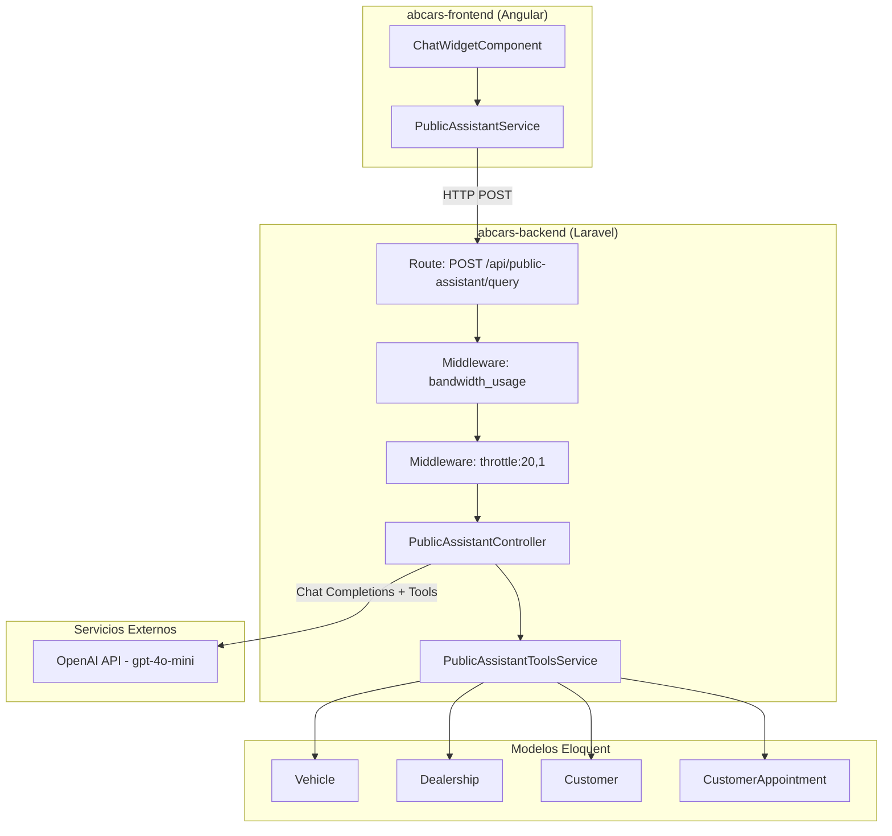
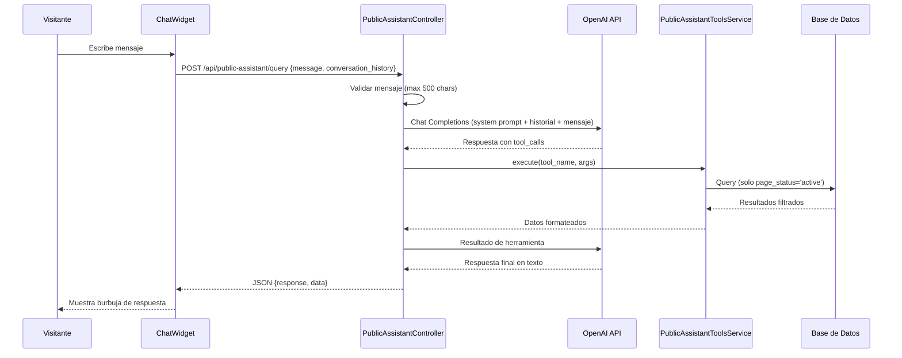

# Documento de Diseño — Asistente Público (Chatbot)

## Resumen

Este documento describe el diseño técnico del Asistente Público (Chatbot) para ABCars. El sistema expone un chatbot conversacional basado en OpenAI al público general, sin requerir autenticación, limitado a cinco capacidades: búsqueda de inventario público, detalles de vehículos, creación de citas, confirmación de citas y consulta de estatus de citas.

La arquitectura sigue el patrón ya establecido por el asistente interno (`AssistantController` + `AssistantToolsService`), pero con un controlador y servicio de herramientas completamente independientes para garantizar el aislamiento de datos.

## Arquitectura

### Diagrama de Componentes



### Flujo de Interacción



## Componentes e Interfaces

### Backend (Laravel)

#### 1. PublicAssistantController

Ubicación: `app/Http/Controllers/PublicAssistant/PublicAssistantController.php`

Controlador independiente del `AssistantController` existente. Maneja el endpoint público sin autenticación.

```php
class PublicAssistantController extends Controller
{
    public function __construct(
        private PublicAssistantToolsService $toolsService
    ) {}

    public function query(Request $request): JsonResponse
    // Valida message (string, max:500)
    // Valida conversation_history (array, opcional, max 20 elementos)
    // Verifica OPENAI_API_KEY
    // Llama a callChatGPTWithTools()
    // Registra en log: IP + mensaje (sin datos personales)
    // Retorna {response: string, data: array|null}
}
```

#### 2. PublicAssistantToolsService

Ubicación: `app/Services/PublicAssistant/PublicAssistantToolsService.php`

Clase completamente independiente de `AssistantToolsService`. Define y ejecuta las 5 herramientas públicas.

```php
class PublicAssistantToolsService
{
    public function execute(string $toolName, array $arguments): array
    // Despacha a: search_public_vehicles, get_vehicle_details,
    //   create_appointment, confirm_appointment, get_appointment_status

    public function getToolsDefinitions(): array
    // Retorna las definiciones de las 5 herramientas para OpenAI

    private function searchPublicVehicles(array $args): array
    // Filtra Vehicle con page_status='active'
    // Parámetros: keyword, brand, type, min_price, max_price
    // Máximo 10 resultados, ordenados por created_at desc
    // Campos públicos solamente

    private function getVehicleDetails(string $uuid): array
    // Busca por UUID, solo si page_status='active'
    // Incluye imágenes y especificaciones
    // Excluye: id, vin, purchase_date, sale_price, customer_id

    private function createAppointment(array $args): array
    // Valida: nombre (min 2), teléfono (10 dígitos), email, fecha futura, sucursal
    // Busca o crea Customer por teléfono/email
    // Crea CustomerAppointment con type='visit', status='scheduled'
    // Retorna: uuid, fecha, sucursal

    private function confirmAppointment(string $uuid): array
    // Busca cita por UUID (no soft-deleted)
    // Solo actualiza si status='scheduled' → 'confirmed'
    // Retorna estado actualizado

    private function getAppointmentStatus(string $uuid): array
    // Busca cita por UUID
    // Retorna: status, scheduled_date, dealership_name, type
    // Omite: customer_id, vehicle_id, referrer_user_id, valuación
}
```

#### 3. Ruta API

```php
// routes/api.php
Route::prefix('public-assistant')->middleware(['bandwidth_usage', 'throttle:20,1'])->group(function () {
    Route::post('/query', [PublicAssistantController::class, 'query']);
});
```

#### 4. Form Request (opcional)

Ubicación: `app/Http/Requests/PublicAssistantQueryRequest.php`

```php
class PublicAssistantQueryRequest extends FormRequest
{
    public function rules(): array
    {
        return [
            'message' => 'required|string|max:500',
            'conversation_history' => 'nullable|array|max:20',
            'conversation_history.*.role' => 'required_with:conversation_history|string|in:user,assistant',
            'conversation_history.*.content' => 'required_with:conversation_history|string|max:1000',
        ];
    }
}
```

### Frontend (Angular)

#### 1. PublicAssistantService

Ubicación: `src/app/shared/services/public-assistant.service.ts`

```typescript
@Injectable({ providedIn: 'root' })
export class PublicAssistantService {
  sendMessage(message: string, conversationHistory: ChatMessage[]): Observable<AssistantResponse>
}
```

#### 2. ChatWidgetComponent

Ubicación: `src/app/shared/chat-widget/`

Componente standalone que se agrega al `app.component.html`. Incluye:
- Botón flotante (esquina inferior derecha, posición fija)
- Panel de conversación expandible
- Historial de mensajes en memoria (sessionStorage para persistencia de sesión)
- Indicador de carga (typing indicator)
- Manejo de errores con mensaje amigable
- Timeout de 30 segundos

```typescript
@Component({
  selector: 'app-chat-widget',
  standalone: true,
  // ...
})
export class ChatWidgetComponent {
  isOpen: boolean = false;
  messages: ChatMessage[] = [];
  isLoading: boolean = false;
  currentMessage: string = '';

  toggleChat(): void
  sendMessage(): void
  private loadHistory(): void   // desde sessionStorage
  private saveHistory(): void   // a sessionStorage
}
```

#### 3. Interfaces

```typescript
interface ChatMessage {
  role: 'user' | 'assistant';
  content: string;
  timestamp: Date;
}

interface AssistantResponse {
  response: string;
  data: any | null;
}
```

## Modelos de Datos

### Modelos existentes utilizados (sin modificaciones)

| Modelo | Tabla | Uso |
|--------|-------|-----|
| `Vehicle` | `vehicles` | Búsqueda de inventario público (`page_status = 'active'`) |
| `VehicleBrand` | `vehicle_brands` | Nombre de marca para filtros |
| `BrandLine` | `brand_lines` | Nombre de línea |
| `LineModel` | `line_models` | Año/modelo |
| `Dealership` | `dealerships` | Sucursales disponibles |
| `Customer` | `customers` | Crear/buscar cliente al agendar cita |
| `CustomerAppointment` | `customer_appointments` | Crear, confirmar y consultar citas |
| `VehicleImage` | `vehicle_images` | Imágenes de vehículos |
| `VehicleSpecification` | `vehicle_specifications` | Especificaciones detalladas |

### Campos públicos de Vehicle (whitelist)

Solo estos campos se exponen al asistente público:

| Campo | Descripción |
|-------|-------------|
| `uuid` | Identificador público |
| `name` | Nombre del vehículo |
| `brand.name` | Marca |
| `line.name` | Línea |
| `model.name` | Modelo (año) |
| `list_price` | Precio de lista |
| `offer_price` | Precio de oferta |
| `mileage` | Kilometraje |
| `fuel_type` | Tipo de combustible |
| `transmission` | Transmisión |
| `exterior_color` | Color exterior |
| `category` | Categoría |
| `type` | Tipo (nuevo/seminuevo) |
| `dealership.name` | Sucursal |
| `firstImage.url` | URL de primera imagen |

### Campos excluidos (blacklist)

Nunca se exponen: `id`, `vin`, `purchase_date`, `sale_price`, `customer_id`, `vehicle_id`, `referrer_user_id`, `deleted_at`, datos de valuación.

### Datos de cita retornados al público

| Campo | Descripción |
|-------|-------------|
| `uuid` | Código de cita |
| `status` | Estado (scheduled, confirmed, etc.) |
| `scheduled_date` | Fecha programada |
| `dealership_name` | Nombre de sucursal |
| `type` | Tipo de cita |


## Propiedades de Correctitud

*Una propiedad es una característica o comportamiento que debe mantenerse verdadero en todas las ejecuciones válidas de un sistema — esencialmente, una declaración formal sobre lo que el sistema debe hacer. Las propiedades sirven como puente entre especificaciones legibles por humanos y garantías de correctitud verificables por máquina.*

### Propiedad 1: Validación de mensaje

*Para cualquier* cadena de texto enviada como `message`, el endpoint debe aceptar la solicitud si y solo si la cadena no está vacía y tiene 500 caracteres o menos. Cadenas vacías o que excedan 500 caracteres deben retornar HTTP 422.

**Valida: Requerimientos 1.3, 1.4**

### Propiedad 2: Rate limiting por IP

*Para cualquier* dirección IP, si se envían más de 20 solicitudes en un periodo de 1 minuto, todas las solicitudes adicionales deben ser rechazadas con HTTP 429.

**Valida: Requerimiento 1.2**

### Propiedad 3: Exclusión de campos internos en respuestas

*Para cualquier* ejecución de herramienta del asistente público, la respuesta nunca debe contener los campos prohibidos (`id`, `vin`, `purchase_date`, `sale_price`, `customer_id`, `vehicle_id`, `referrer_user_id`, `deleted_at`, datos de valuación), y todos los vehículos retornados deben tener `page_status = 'active'`.

**Valida: Requerimientos 2.5, 3.1, 3.4, 6.4, 9.3**

### Propiedad 4: Filtros de búsqueda de vehículos

*Para cualquier* combinación de parámetros de filtro (`keyword`, `brand`, `type`, `min_price`, `max_price`), todos los vehículos retornados por `search_public_vehicles` deben cumplir con todos los filtros especificados simultáneamente.

**Valida: Requerimiento 3.2**

### Propiedad 5: Límite máximo de resultados de búsqueda

*Para cualquier* consulta de búsqueda de vehículos, independientemente de cuántos vehículos coincidan con los filtros, el número de resultados retornados debe ser menor o igual a 10.

**Valida: Requerimiento 3.3**

### Propiedad 6: Validación de datos de cita

*Para cualquier* conjunto de datos de entrada para crear una cita, si el nombre tiene menos de 2 caracteres, el teléfono no tiene exactamente 10 dígitos, el email no tiene formato válido, o la fecha no es futura, la herramienta `create_appointment` debe rechazar la solicitud con un mensaje de error descriptivo.

**Valida: Requerimiento 4.2**

### Propiedad 7: Creación de cita con datos válidos

*Para cualquier* conjunto de datos válidos (nombre ≥ 2 chars, teléfono de 10 dígitos, email válido, fecha futura, sucursal existente), `create_appointment` debe crear un registro `CustomerAppointment` con `type = 'visit'` y `status = 'scheduled'`, y la respuesta debe contener el UUID de la cita, la fecha programada y el nombre de la sucursal.

**Valida: Requerimientos 4.4, 4.5**

### Propiedad 8: Validación de sucursal existente

*Para cualquier* nombre de sucursal que no exista en la tabla `dealerships`, la herramienta `create_appointment` debe rechazar la solicitud indicando que la sucursal no es válida.

**Valida: Requerimiento 4.6**

### Propiedad 9: Confirmación condicional de cita

*Para cualquier* cita existente, la herramienta `confirm_appointment` debe cambiar el estado a `confirmed` si y solo si el estado actual es `scheduled`. Si el estado es diferente de `scheduled`, el estado no debe modificarse.

**Valida: Requerimientos 5.3, 5.4**

### Propiedad 10: Respuesta de estatus de cita

*Para cualquier* cita existente consultada por UUID, la respuesta de `get_appointment_status` debe contener exactamente: estado actual, fecha programada, nombre de sucursal y tipo de cita.

**Valida: Requerimiento 6.3**

### Propiedad 11: Persistencia de historial de chat (round-trip)

*Para cualquier* secuencia de mensajes en el widget de chat, guardar el historial en sessionStorage y luego cargarlo debe producir exactamente la misma secuencia de mensajes con su contenido y roles intactos.

**Valida: Requerimientos 8.6, 8.7**

## Manejo de Errores

| Escenario | Código HTTP | Respuesta |
|-----------|-------------|-----------|
| Campo `message` vacío o > 500 chars | 422 | Error de validación estándar de Laravel |
| OPENAI_API_KEY no configurada | 503 | `{"response": "El asistente no está disponible en este momento.", "data": null}` |
| Rate limit excedido (>20 req/min) | 429 | Respuesta estándar de throttle de Laravel |
| Error de OpenAI API (401) | 200 | `{"response": "Error temporal del asistente. Intenta de nuevo.", "data": null}` |
| Error de OpenAI API (429) | 200 | `{"response": "El asistente está ocupado. Intenta en unos momentos.", "data": null}` |
| Timeout de OpenAI (>45s) | 200 | `{"response": "Error temporal del asistente. Intenta de nuevo.", "data": null}` |
| UUID de cita no encontrado | 200 | Respuesta del asistente indicando que no se encontró la cita |
| UUID de cita soft-deleted | 200 | Respuesta del asistente indicando código no válido |
| Sucursal no encontrada | 200 | Respuesta del asistente indicando sucursal no válida |
| Datos de cita inválidos | 200 | Respuesta del asistente solicitando corrección de datos |
| Error general/excepción | 500 | `{"response": "Error temporal del asistente. Intenta de nuevo.", "data": null}` |
| Frontend: timeout 30s | — | Mensaje en widget: "No pudimos obtener respuesta. Intenta de nuevo." |
| Frontend: error de red | — | Mensaje en widget: "Error de conexión. Verifica tu internet e intenta de nuevo." |

### Logging

- Cada consulta al endpoint se registra con: IP, mensaje enviado, timestamp
- No se almacenan datos personales del visitante (nombre, teléfono, email proporcionados en conversación)
- Los errores de OpenAI se registran con `Log::error` incluyendo status y body
- El middleware `bandwidth_usage` registra automáticamente request/response sizes

## Estrategia de Testing

### Enfoque Dual

Se utilizarán dos tipos de tests complementarios:

1. **Tests unitarios**: Verifican ejemplos específicos, casos borde y condiciones de error
2. **Tests de propiedad (property-based)**: Verifican propiedades universales con entradas generadas aleatoriamente

### Librería de Property-Based Testing

- **Backend (PHP)**: [PhpQuickCheck](https://github.com/steffenfriedrich/phpquickcheck) o alternativamente `eris/eris` para generación de datos aleatorios con PHPUnit
- **Frontend (TypeScript)**: [fast-check](https://github.com/dubzzz/fast-check) con Jasmine (ya configurado en el proyecto)

### Configuración

- Mínimo **100 iteraciones** por test de propiedad
- Cada test de propiedad debe incluir un comentario referenciando la propiedad del diseño:
  - Formato: `Feature: public-assistant-chatbot, Property {N}: {título}`

### Tests Unitarios (Backend - PHPUnit)

| Test | Descripción | Tipo |
|------|-------------|------|
| Endpoint sin auth retorna 200 | Verificar que no requiere `auth:sanctum` | Ejemplo |
| OPENAI_API_KEY faltante retorna 503 | Verificar respuesta cuando falta la key | Ejemplo |
| Tools definitions contiene exactamente 5 herramientas | Verificar herramientas registradas | Ejemplo |
| PublicAssistantToolsService no extiende AssistantToolsService | Verificar independencia | Ejemplo |
| get_vehicle_details con UUID válido retorna datos | Verificar detalle de vehículo activo | Ejemplo |
| get_vehicle_details con UUID inactivo retorna error | Verificar exclusión de inactivos | Ejemplo |
| confirm_appointment con cita soft-deleted retorna error | Caso borde | Ejemplo |
| get_appointment_status con UUID inexistente retorna not found | Caso borde | Ejemplo |

### Tests de Propiedad (Backend - PHPUnit + eris)

| Test | Propiedad | Iteraciones |
|------|-----------|-------------|
| Validación de mensaje acepta strings válidos y rechaza inválidos | Propiedad 1 | 100 |
| Respuestas de herramientas nunca contienen campos prohibidos | Propiedad 3 | 100 |
| Filtros de búsqueda retornan solo vehículos que cumplen todos los criterios | Propiedad 4 | 100 |
| Búsqueda retorna máximo 10 resultados | Propiedad 5 | 100 |
| Validación de cita rechaza datos inválidos | Propiedad 6 | 100 |
| Creación de cita con datos válidos produce registro correcto | Propiedad 7 | 100 |
| Sucursal inexistente rechaza creación de cita | Propiedad 8 | 100 |
| Confirmación solo modifica citas con status 'scheduled' | Propiedad 9 | 100 |
| Respuesta de estatus contiene campos requeridos | Propiedad 10 | 100 |

### Tests de Propiedad (Frontend - Jasmine + fast-check)

| Test | Propiedad | Iteraciones |
|------|-----------|-------------|
| Round-trip de historial en sessionStorage preserva mensajes | Propiedad 11 | 100 |

### Tests Unitarios (Frontend - Jasmine)

| Test | Descripción | Tipo |
|------|-------------|------|
| Botón flotante visible en esquina inferior derecha | Verificar posicionamiento CSS | Ejemplo |
| Click en botón abre panel con mensaje de bienvenida | Verificar interacción UI | Ejemplo |
| Indicador de carga visible durante solicitud | Verificar estado isLoading | Ejemplo |
| Timeout de 30s muestra mensaje de error | Verificar manejo de timeout | Ejemplo |
| Error de red muestra mensaje amigable | Verificar manejo de errores | Ejemplo |
