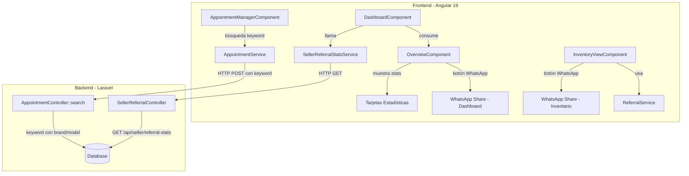

# Documento de Diseño — Completar Módulo de Referidos del Vendedor

## Resumen

Este diseño cubre las piezas faltantes del módulo de referidos para vendedores en ABCars: un endpoint backend de estadísticas, la integración de esas estadísticas en el dashboard del vendedor, botones de compartir por WhatsApp (dashboard e inventario), búsqueda funcional en "Mis referidos" con filtro por marca/modelo, y la corrección del bug de búsqueda con `orWhere` en el `AppointmentController`.

La infraestructura existente ya maneja la generación de links de referido (`ReferralService`), captura del parámetro `?ref=`, almacenamiento en `sessionStorage`, tracking de `referrer_user_id` en `customer_appointments`, la vista "Mis referidos" y la asignación de valuador.

## Arquitectura



### Decisiones de Diseño

1. **Nuevo controlador `SellerReferralController`**: Se crea un controlador dedicado en lugar de agregar métodos al `AppointmentController` existente, para mantener separación de responsabilidades. El endpoint de estadísticas es conceptualmente diferente a la gestión de citas.

2. **Nuevo servicio Angular `SellerReferralStatsService`**: Servicio dedicado para las estadísticas del vendedor, separado del `AppointmentService` existente que maneja citas.

3. **WhatsApp via `window.open`**: Se usa `window.open` con la API de WhatsApp Web (`https://wa.me/?text=`) en lugar de un SDK, ya que es la forma estándar y no requiere dependencias adicionales.

4. **Corrección del bug de búsqueda**: El `AppointmentController::search` actual usa `orWhere` para el keyword, lo que ignora el filtro de `referrer_user_id` del seller. Se corrige usando un closure `where(function($q) { ... })` para agrupar las condiciones OR dentro de un AND.

5. **Búsqueda por marca/modelo**: Se extiende la query existente en `AppointmentController::search` para incluir `brand_name` y `model_name` de `customer_vehicles` en el filtro de keyword.

## Componentes e Interfaces

### Backend

#### 1. `SellerReferralController` (nuevo)
- **Ubicación**: `app/Http/Controllers/Seller/SellerReferralController.php`
- **Método**: `stats(Request $request): JsonResponse`
- **Ruta**: `GET /api/seller/referral-stats`
- **Middleware**: `auth:sanctum`
- **Responsabilidad**: Calcular y devolver estadísticas de referidos del vendedor autenticado.
- **Validación de rol**: Verificar que el usuario tenga rol `seller` antes de procesar.

#### 2. `AppointmentController::search` (modificación)
- **Ubicación**: `app/Http/Controllers/Appointments/AppointmentController.php`
- **Cambio**: Corregir el uso de `orWhere` por un closure agrupado, y agregar filtro por `brand_name` y `model_name`.

### Frontend

#### 3. `SellerReferralStatsService` (nuevo)
- **Ubicación**: `app/shared/services/seller-referral-stats.service.ts`
- **Método**: `getStats(): Observable<ReferralStatsResponse>`
- **Responsabilidad**: Llamar al endpoint `/api/seller/referral-stats`.

#### 4. `OverviewComponent` (modificación)
- **Cambios**:
  - Agregar `@Input() referralStats` para recibir estadísticas.
  - Agregar botón de WhatsApp junto al botón "Copiar" del link de referido.
  - Mostrar valores de estadísticas en las tarjetas del CTA banner.
  - Agregar `@Input() statsLoading` para indicador de carga.

#### 5. `DashboardComponent` (modificación)
- **Cambios**:
  - Inyectar `SellerReferralStatsService`.
  - Llamar a `getStats()` en el constructor para sellers.
  - Pasar estadísticas y estado de carga al `OverviewComponent`.

#### 6. `AppointmentManagerComponent` (modificación)
- **Cambios**:
  - Agregar propiedad `searchKeyword: string`.
  - Vincular el input de búsqueda con `[(ngModel)]`.
  - Implementar búsqueda con debounce de 400ms y al presionar Enter.
  - Pasar `keyword` al servicio `AppointmentService`.

#### 7. `AppointmentService` (modificación)
- **Cambios**:
  - Modificar `getExternalDates` para aceptar parámetro `keyword` opcional.

#### 8. `InventoryViewComponent` (modificación)
- **Cambios**:
  - Agregar método `shareVehicleWhatsApp(vehicle: Vehicle, event: Event)`.
  - Agregar botón de WhatsApp en la columna de acciones de la tabla.

### Interfaces

```typescript
// Respuesta del endpoint de estadísticas
interface ReferralStatsResponse {
  status: number;
  message: string;
  data: {
    total_referrals: number;
    month_referrals: number;
    converted_referrals: number;
  };
}

// Input para el overview component
interface ReferralStats {
  totalReferrals: number;
  monthReferrals: number;
  convertedReferrals: number;
}
```

## Modelos de Datos

### Modelos existentes utilizados

#### `CustomerAppointment`
- **Tabla**: `{prefix}customer_appointments`
- **Campo clave**: `referrer_user_id` (FK a `users.id`) — identifica al vendedor que generó el referido.
- **Relación**: `valuation()` → `HasOne(VehicleValuation)` — permite determinar si un referido fue convertido.

#### `VehicleValuation`
- **Tabla**: `{prefix}vehicle_valuations`
- **Campo clave**: `status` — determina si la valuación está completada.
- **Campo clave**: `appointment_id` (FK a `customer_appointments.id`).

#### `CustomerVehicle`
- **Tabla**: `{prefix}customer_vehicles`
- **Campos clave**: `brand_name`, `model_name` — usados para el filtro de búsqueda extendido.

### Queries de estadísticas

```sql
-- total_referrals
SELECT COUNT(*) FROM {prefix}customer_appointments 
WHERE referrer_user_id = :seller_id AND deleted_at IS NULL;

-- month_referrals
SELECT COUNT(*) FROM {prefix}customer_appointments 
WHERE referrer_user_id = :seller_id 
  AND MONTH(created_at) = :current_month 
  AND YEAR(created_at) = :current_year
  AND deleted_at IS NULL;

-- converted_referrals
SELECT COUNT(*) FROM {prefix}customer_appointments ca
JOIN {prefix}vehicle_valuations vv ON vv.appointment_id = ca.id
WHERE ca.referrer_user_id = :seller_id 
  AND vv.status = 'completed'
  AND ca.deleted_at IS NULL
  AND vv.deleted_at IS NULL;
```

### Query de búsqueda corregida

```sql
-- Búsqueda con keyword agrupada correctamente
SELECT ... FROM {prefix}customer_appointments
LEFT JOIN {prefix}customers ON ...
LEFT JOIN {prefix}customer_vehicles ON ...
WHERE referrer_user_id = :seller_id  -- filtro seller siempre activo
  AND (
    customers.name LIKE '%keyword%'
    OR customers.last_name LIKE '%keyword%'
    OR customers.phone_1 LIKE '%keyword%'
    OR customer_vehicles.brand_name LIKE '%keyword%'
    OR customer_vehicles.model_name LIKE '%keyword%'
  )
```


## Propiedades de Correctitud

*Una propiedad es una característica o comportamiento que debe mantenerse verdadero en todas las ejecuciones válidas de un sistema — esencialmente, una declaración formal sobre lo que el sistema debe hacer. Las propiedades sirven como puente entre especificaciones legibles por humanos y garantías de correctitud verificables por máquina.*

### Propiedad 1: Cálculo correcto de estadísticas de referidos

*Para cualquier* conjunto de citas (`customer_appointments`) con distintos `referrer_user_id` y fechas de creación, y con valuaciones en distintos estados, las estadísticas devueltas por el endpoint para un vendedor dado deben cumplir:
- `total_referrals` es igual al conteo de citas donde `referrer_user_id` = ID del vendedor
- `month_referrals` es igual al conteo de esas citas cuya fecha de creación pertenece al mes y año actual
- `converted_referrals` es igual al conteo de esas citas que tienen una `vehicle_valuation` asociada con `status = 'completed'`

**Valida: Requisitos 1.2, 1.3, 1.4**

### Propiedad 2: Renderizado de estadísticas en tarjetas del dashboard

*Para cualquier* objeto de estadísticas con valores numéricos no negativos, al renderizar las tarjetas del dashboard, cada tarjeta debe mostrar el valor numérico correspondiente en lugar del placeholder "—": `month_referrals` en "REFERIDOS MES", `total_referrals` en "REFERIDOS TOTAL", y `converted_referrals` en "CONVERTIDOS".

**Valida: Requisitos 2.2, 2.3, 2.4**

### Propiedad 3: Construcción de URL de WhatsApp para link de referido del dashboard

*Para cualquier* link de referido válido (URL no vacía), la URL de WhatsApp generada debe: (a) comenzar con `https://wa.me/?text=`, (b) contener el link de referido completo dentro del mensaje codificado, (c) incluir texto introductorio en español, y (d) al decodificar el parámetro `text`, el link de referido original debe estar presente sin alteraciones.

**Valida: Requisitos 3.2, 3.3, 3.4**

### Propiedad 4: Filtrado de búsqueda por keyword en campos múltiples

*Para cualquier* keyword y conjunto de citas de un vendedor, una cita debe aparecer en los resultados si y solo si el keyword coincide parcialmente (LIKE) con al menos uno de los campos: nombre del cliente, apellido del cliente, teléfono, `brand_name` o `model_name` del vehículo.

**Valida: Requisitos 4.2, 6.1**

### Propiedad 5: Aislamiento de referidos por vendedor (invariante)

*Para cualquier* vendedor autenticado y cualquier keyword de búsqueda (incluyendo vacío), todos los registros devueltos por el endpoint de búsqueda de citas deben tener `referrer_user_id` igual al ID del vendedor autenticado. Nunca se deben devolver citas de otros vendedores.

**Valida: Requisito 6.2**

### Propiedad 6: Construcción de URL de WhatsApp para vehículo específico

*Para cualquier* vehículo con nombre y UUID, y cualquier UUID de vendedor, la URL de WhatsApp generada debe: (a) comenzar con `https://wa.me/?text=`, (b) contener el nombre del vehículo en el mensaje, (c) contener el link de referido del vehículo (construido por `buildVehicleReferralUrl`), y (d) estar correctamente codificada con `encodeURIComponent`.

**Valida: Requisitos 5.2, 5.4**

## Manejo de Errores

| Escenario | Componente | Comportamiento |
|---|---|---|
| Usuario no autenticado llama a `/api/seller/referral-stats` | `SellerReferralController` | Responde HTTP 401 con mensaje de error |
| Usuario sin rol `seller` llama a `/api/seller/referral-stats` | `SellerReferralController` | Responde HTTP 403 con mensaje de error |
| Error interno en cálculo de estadísticas | `SellerReferralController` | Responde HTTP 500 con mensaje genérico, sin exponer detalles |
| Falla la petición de estadísticas en frontend | `DashboardComponent` | Muestra "0" en cada tarjeta de estadísticas |
| UUID del vendedor no disponible en localStorage | `InventoryViewComponent` | Muestra alerta de error con SweetAlert2 |
| Búsqueda sin resultados | `AppointmentManagerComponent` | Muestra "No hay datos que coincidan con el filtro" (comportamiento existente de `matNoDataRow`) |
| Keyword vacío en búsqueda | `AppointmentController` | Omite filtro de keyword, devuelve todos los referidos del vendedor |

## Estrategia de Testing

### Testing Unitario

Los tests unitarios cubren ejemplos específicos, edge cases y condiciones de error:

- **Backend**:
  - Test del endpoint `/api/seller/referral-stats` con datos conocidos (ejemplo específico)
  - Test de autorización: usuario no autenticado recibe 401
  - Test de autorización: usuario sin rol seller recibe 403
  - Test de búsqueda con keyword vacío devuelve todos los referidos
  - Test de búsqueda sin resultados devuelve lista vacía

- **Frontend**:
  - Test que `DashboardComponent` llama a `getStats()` al inicializar para sellers
  - Test que el botón de WhatsApp existe cuando `referralLink` está presente
  - Test que el indicador de carga se muestra mientras la petición está en curso
  - Test que al fallar la petición, las estadísticas muestran "0"
  - Test que el input de búsqueda está vinculado con `ngModel`
  - Test que el botón de WhatsApp de inventario muestra error cuando UUID no está disponible

### Testing Basado en Propiedades

Se usará **PHPUnit** con un generador de datos aleatorios personalizado para el backend, y **fast-check** para el frontend Angular.

Cada test de propiedad debe ejecutar un mínimo de **100 iteraciones**.

Cada test debe estar etiquetado con un comentario referenciando la propiedad del diseño:

```
// Feature: seller-referral-completion, Property {N}: {título de la propiedad}
```

- **Propiedad 1** (Backend - PHPUnit): Generar conjuntos aleatorios de citas con distintos `referrer_user_id`, fechas y estados de valuación. Verificar que las tres estadísticas calculadas coinciden con los conteos esperados.
- **Propiedad 2** (Frontend - fast-check): Generar objetos de estadísticas con valores numéricos aleatorios. Verificar que el componente renderiza cada valor en la tarjeta correcta.
- **Propiedad 3** (Frontend - fast-check): Generar URLs de referido aleatorias. Verificar que la URL de WhatsApp resultante cumple las condiciones de formato y que el link original se preserva tras decodificar.
- **Propiedad 4** (Backend - PHPUnit): Generar conjuntos de citas con datos aleatorios en nombre, apellido, teléfono, marca y modelo. Para cada keyword, verificar que los resultados contienen exactamente las citas que coinciden parcialmente en al menos un campo.
- **Propiedad 5** (Backend - PHPUnit): Generar múltiples vendedores con citas mezcladas. Para cada vendedor y keyword, verificar que todos los resultados tienen `referrer_user_id` del vendedor consultante.
- **Propiedad 6** (Frontend - fast-check): Generar nombres de vehículos, UUIDs de vehículos y UUIDs de vendedores aleatorios. Verificar que la URL de WhatsApp contiene el nombre del vehículo y el link de referido correcto.
