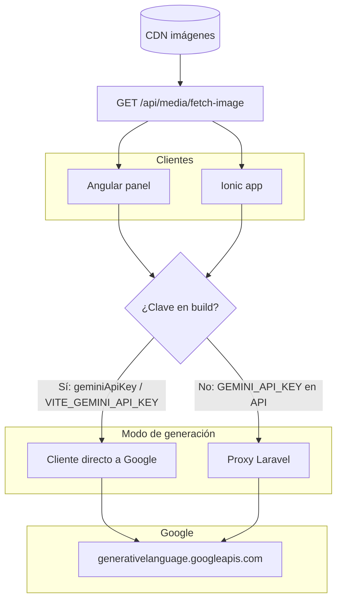

# Módulo de IA para imágenes de vehículo (ABCars)

Documentación de **cómo está creado e integrado** el módulo que procesa fotos de galería con **Google Gemini (generación de imagen)**: recorte del vehículo, fondo ciclorama de catálogo ABCars y embellecimiento ligero.

Aplica a:

- **Panel web** (`abcars-frontend`, Angular)
- **App móvil** (`abcars-valuation-ionic`, Ionic + Capacitor)
- **API** (`abcars-backend`, Laravel)
- **Laboratorio opcional** (`abcars-imagen-studio`, Vite + React)

Para portar el mismo enfoque a otro monorepo, ver también [implementacion-modulo-edicion-imagenes-grupovecsa.md](./implementacion-modulo-edicion-imagenes-grupovecsa.md).

---

## 1. Objetivo del módulo

| Caso de uso | Descripción |
|-------------|-------------|
| **Subir con IA** | El usuario elige fotos locales; antes de guardarlas en el vehículo, pasan por Gemini (recorte + ciclorama). |
| **Reprocesar existente** | Se descarga la imagen actual (URL CDN), se envía a Gemini y se reemplaza en la misma posición de la galería. |
| **App móvil** | En **Fotos del vehículo**, interruptor “IA” y reprocesado foto a foto; misma lógica que el panel. |

**Criterio de producto:** el fondo original (techo, sala, cielo) **no debe quedar visible**, ni difuminado en una franja superior. Solo ciclorama con paleta fija ABCars.

---

## 2. Arquitectura

Hay **dos modos** de llamar a Gemini; el cliente elige automáticamente el primero disponible:



| Modo | Cuándo | Ventaja |
|------|--------|---------|
| **Servidor (recomendado)** | `GEMINI_API_KEY` en Laravel; cliente sin clave en el bundle | Sin exponer la clave; JSON base64 estable en Android/iOS; sin CORS a Google desde WebView. |
| **Cliente** | `geminiApiKey` (Angular) o `VITE_GEMINI_API_KEY` (Ionic) en el build | Útil en desarrollo o si el frontend ya tenía la clave en CI. |

En ambos modos el **texto del prompt** de recorte debe mantenerse alineado (ver sección 8).

---

## 3. Backend (Laravel)

### 3.1 Rutas API (`routes/api.php`)

Prefijo `studio-catalog`, middleware `auth:sanctum`:

| Método | Ruta | Controlador | Permisos / notas |
|--------|------|-------------|------------------|
| `GET` | `/studio-catalog/gemini/capabilities` | `geminiCapabilities` | Cualquier usuario autenticado. Responde si el servidor tiene clave (no la expone). |
| `POST` | `/studio-catalog/gemini/generate-recorte` | `geminiGenerateRecorte` | `super_admin`, `administrator`, `marketing`, `create vehicles`, `update vehicles` (misma política que subir fotos). |
| `GET` | `/studio-catalog/background` | `showBackground` | Ciclorama maestro (marketing). |
| `POST` | `/studio-catalog/background` | `storeBackground` | Solo `administrator` / `super_admin`. |
| `DELETE` | `/studio-catalog/background` | `resetBackground` | Solo admin. |

**Proxy CORS de imágenes** (reprocesar URLs de CDN):

| Método | Ruta | Controlador |
|--------|------|-------------|
| `GET` | `/media/fetch-image?url=` | `ImageFetchProxyController@fetch` |

Requiere Sanctum y roles de marketing/vehículos. Lista blanca de hosts en `config/external_image_proxy.php` (`EXTERNAL_IMAGE_PROXY_ALLOWED_HOSTS`).

### 3.2 Archivos principales

```
abcars-backend/
  app/Http/Controllers/StudioCatalog/StudioCatalogController.php
  app/Support/VehicleGeminiRecortePrompt.php
  app/Http/Controllers/Media/ImageFetchProxyController.php
  config/services.php          → services.gemini.*
  config/external_image_proxy.php
  routes/api.php
```

### 3.3 `geminiCapabilities`

Respuesta de éxito (envuelta por `ApiResponseHelper`):

```json
{
  "status": 200,
  "message": "Capacidades IA",
  "data": {
    "server_gemini": true
  }
}
```

El frontend interpreta `data.server_gemini` (o `server_gemini` en la raíz, según el helper).

### 3.4 `geminiGenerateRecorte`

**Request (JSON):**

```json
{
  "mime": "image/jpeg",
  "image_base64": "<base64 sin saltos de línea>"
}
```

- `mime`: `image/jpeg`, `image/jpg`, `image/png`, `image/webp`
- `image_base64`: máximo ~18 MB en validación

**Response (éxito):**

```json
{
  "status": 200,
  "message": "Imagen generada",
  "data": {
    "mime": "image/png",
    "base64": "..."
  }
}
```

**Comportamiento interno:**

- Lee `config('services.gemini.api_key')` y modelo `GEMINI_IMAGE_MODEL` (default `gemini-3.1-flash-image-preview`).
- Arma el prompt con `VehicleGeminiRecortePrompt::build()` (espejo de la app móvil y del panel).
- `POST` a `{base_url}/v1beta/models/{model}:generateContent` con `inline_data` + `generationConfig` (`aspectRatio: 4:3`, `imageSize: 2K`).
- Timeout HTTP **180 s**; `set_time_limit(200)` en PHP.

**Códigos de error habituales (`code` en JSON):**

| Código | HTTP | Significado |
|--------|------|-------------|
| `GEMINI_NOT_CONFIGURED` | 503 | Falta `GEMINI_API_KEY` en el servidor |
| `GEMINI_TRANSPORT` | 502 | No se pudo contactar a Google |
| `GEMINI_HTTP_ERROR` | 4xx/5xx de Google | Mensaje en `message` |
| `GEMINI_BLOCKED` | 422 | `promptFeedback.blockReason` |
| `GEMINI_PARSE` | 502 | Respuesta sin imagen inline |

### 3.5 Variables de entorno (backend)

```env
# Obligatoria para IA en servidor (cualquiera de estos nombres en config/services.php)
GEMINI_API_KEY=

# Opcionales
GEMINI_IMAGE_MODEL=gemini-3.1-flash-image-preview
GEMINI_API_BASE_URL=https://generativelanguage.googleapis.com

# Proxy de descarga de imágenes CDN
EXTERNAL_IMAGE_PROXY_ALLOWED_HOSTS=*.cloudfront.net,*.cloudinary.com,res.cloudinary.com
```

En **Railway**, la clave debe estar en el **mismo servicio** que sirve la API que usan el panel y la app móvil.

---

## 4. Panel web (Angular)

### 4.1 Servicios

| Archivo | Rol |
|---------|-----|
| `shared/services/gemini-vehicle-image.service.ts` | Capabilities, `processFilesRecorteEmbellecer`, llamada directa a Google o `generate-recorte` vía Laravel. |
| `shared/services/vehicle-image-ai-queue.service.ts` | Cola / UI de procesamiento en galería. |
| `shared/services/vehicle-gallery-replace.service.ts` | Borrar imagen → subir nueva → `changeOrder` (misma posición). |
| `shared/utils/fetch-image-as-file.ts` | Descarga URL; si es CDN sin CORS, usa `/api/media/fetch-image`. |
| `shared/utils/studio-catalog-background.ts` | Constantes de ciclorama (hex, textos EN). |

### 4.2 UI

- `admin/marketing/components/store-vehicle` y `update-vehicle`: pestaña imágenes, varita por fila, cola IA.
- Al iniciar, `refreshGenerationAvailability()` consulta capabilities si no hay `geminiApiKey` en `environment`.

### 4.3 Variables de entorno (build del SPA)

Script `scripts/generate-env-railway.js` (o `environment.example.ts`):

```env
API_URL=https://tu-api.example.com
GEMINI_API_KEY=          # opcional si usas solo proxy servidor
GEMINI_API_BASE_URL=     # opcional
```

**Desarrollo:** `geminiUseDevProxy: true` + `proxy.conf.json` (`/gemini-api` → Google) para evitar CORS en `ng serve`.

---

## 5. App móvil (Ionic)

### 5.1 Servicio

`src/services/geminiVehicleImageService.ts`:

- `isGenerationAvailable()` → clave Vite **o** `GET studio-catalog/gemini/capabilities`
- `processFilesRecorteEmbellecer(files, onProgress)` → cliente o `POST studio-catalog/gemini/generate-recorte`
- Timeout cliente **200 s** (≥ timeout Laravel)
- Procesamiento **secuencial** (una foto a la vez) en `VehiclePhotos.tsx`

### 5.2 Pantalla

`src/pages/manager/VehiclePhotos.tsx`:

- Interruptor IA al subir / reprocesar
- Overlay de carga unificado
- Descarga de imagen existente: `fetchImageAsFile` → proxy si hace falta

### 5.3 Variables (build)

`abcars-valuation-ionic/.env.production`:

```env
VITE_API_BASE_URL=https://TU-API-RAILWAY/api/
# Vacío si solo usas servidor:
VITE_GEMINI_API_KEY=
```

Ver también `abcars-valuation-ionic/README.md` (compilación Android/iOS y comprobación de IA).

---

## 6. Laboratorio `abcars-imagen-studio` (opcional)

Proyecto Vite + React para probar prompts sin desplegar el panel:

- `src/google/geminiImage.ts` — llamada a Gemini
- `src/studio/imagePrompts.ts` — textos de recorte

No es obligatorio en producción; conviene **sincronizar prompts** con `VehicleGeminiRecortePrompt` y `studioCatalogPrompts.ts` cuando se cambie el ciclorama.

---

## 7. Flujos detallados

### 7.1 Subir fotos nuevas con IA (web o móvil)

1. Usuario activa IA y selecciona archivos locales.
2. Por cada archivo: `processFilesRecorteEmbellecer` → `File` transformado.
3. Subida al endpoint de imágenes del vehículo (`vehicle_images`, multipart).
4. En móvil: `FormData` **sin** cabecera `Content-Type` manual (axios/Capacitor fija el boundary).

### 7.2 Reprocesar imagen ya publicada

1. Obtener `service_image_url` de la imagen.
2. `fetchImageAsFile(url)` → si host CDN, `GET /api/media/fetch-image?url=...` con Bearer.
3. Gemini (servidor o cliente).
4. Web: `VehicleGalleryReplaceService.replaceAtIndex`.
5. Móvil: borrar/subir según flujo de `VehiclePhotos`.

### 7.3 Decisión cliente vs servidor

```
Si existe clave en el build del cliente
  → POST directo a Google (prompt en TS)
Si no, y capabilities.server_gemini === true
  → POST /api/studio-catalog/gemini/generate-recorte
Si no
  → Error "IA no disponible"
```

---

## 8. Prompts y ciclorama (fuente de verdad)

Mantener **tres copias alineadas** al cambiar criterios:

| Ubicación | Archivo |
|-----------|---------|
| Backend (proxy servidor) | `app/Support/VehicleGeminiRecortePrompt.php` |
| App móvil (solo modo cliente) | `src/config/studioCatalogPrompts.ts` |
| Panel web (solo modo cliente) | `gemini-vehicle-image.service.ts` + `studio-catalog-background.ts` |

**Paleta fija (hex):**

| Zona | Color |
|------|--------|
| Pared superior | `#fafbfc` |
| Horizonte ciclorama | `#e4e8ec` |
| Piso bajo el vehículo | `#e8ebef` |
| Piso primer plano | `#f2f4f7` |

El prompt combina instrucción en **español** (`PROMPT_RECORTE`) + sufijo técnico en **inglés** (`STUDIO_RECORTE_SUFFIX`) para Gemini imagen.

---

## 9. Modelo y configuración de generación

- **Modelo por defecto:** `gemini-3.1-flash-image-preview`
- **Salida:** `responseModalities: TEXT, IMAGE`
- **Imagen:** relación **4:3**, tamaño **2K** (en cliente y servidor)

---

## 10. Errores frecuentes

| Síntoma | Causa | Acción |
|---------|--------|--------|
| IA deshabilitada en móvil, sí en web | `VITE_API_BASE_URL` apunta a otro host sin `GEMINI_API_KEY` | Unificar URL y variable en Railway; recompilar app. |
| 503 `GEMINI_NOT_CONFIGURED` | Clave vacía en el servicio API | Definir `GEMINI_API_KEY` y redeploy backend. |
| Timeout ~30 s en móvil | Timeout axios corto | Usar 200 s en `generate-recorte` (ya configurado en el servicio). |
| 422 al subir foto tras IA | `Content-Type: application/json` en multipart | No fijar `Content-Type` en `FormData` (`api.ts`). |
| 500 en `fetch-image` sin JSON | Petición sin `Accept: application/json` redirigía a login HTML | `bootstrap/app.php`: JSON en rutas `api/*` si esperan JSON. |
| CORS al bajar imagen CDN | `fetch` directo al CDN | Usar `/api/media/fetch-image` + lista blanca de hosts. |
| HyP / evidencia solo en web | Prompts HyP solo en Angular | No aplica al flujo de galería vehículo en móvil. |

---

## 11. Seguridad

- **No commitear** `GEMINI_API_KEY` ni `VITE_GEMINI_API_KEY` en el repositorio.
- El endpoint `capabilities` **no devuelve** la clave, solo `server_gemini: boolean`.
- `fetch-image`: solo `https`, host en lista blanca, límite de tamaño (SSRF).
- `generate-recorte`: autenticación Sanctum + permisos de edición de vehículos.

---

## 12. Checklist de despliegue

1. [ ] `GEMINI_API_KEY` en el servicio Laravel (Railway).
2. [ ] `EXTERNAL_IMAGE_PROXY_ALLOWED_HOSTS` con los CDN reales.
3. [ ] Panel: `API_URL` en build; opcional `GEMINI_API_KEY` solo si se usa modo cliente.
4. [ ] Móvil: `VITE_API_BASE_URL` = mismo API; `npm run build` + `verify-dist-api-url`.
5. [ ] Probar `GET .../studio-catalog/gemini/capabilities` con token → `server_gemini: true`.
6. [ ] Probar una foto en panel y en app (subida + reprocesar).
7. [ ] Revisar logs Laravel (`geminiGenerateRecorte transport|parse`) si falla Google.

---

## 13. Índice de archivos en el monorepo

```
docs/
  modulo-ia-imagenes-vehiculo.md          ← este documento
  implementacion-modulo-edicion-imagenes-grupovecsa.md

abcars-backend/
  app/Http/Controllers/StudioCatalog/StudioCatalogController.php
  app/Support/VehicleGeminiRecortePrompt.php
  app/Http/Controllers/Media/ImageFetchProxyController.php
  config/services.php
  config/external_image_proxy.php

abcars-frontend/
  src/app/shared/services/gemini-vehicle-image.service.ts
  src/app/shared/services/vehicle-image-ai-queue.service.ts
  src/app/shared/services/vehicle-gallery-replace.service.ts
  src/app/shared/utils/fetch-image-as-file.ts
  src/app/shared/utils/studio-catalog-background.ts

abcars-valuation-ionic/
  src/services/geminiVehicleImageService.ts
  src/config/studioCatalogPrompts.ts
  src/pages/manager/VehiclePhotos.tsx
  src/utils/fetchImageAsFile.ts
  README.md

abcars-imagen-studio/
  src/google/geminiImage.ts
  src/studio/imagePrompts.ts
```

---

*Última revisión: arquitectura con proxy servidor Gemini + app móvil Ionic; prompts ciclorama ABCars alineados entre PHP y TypeScript.*
